```{css, echo = FALSE}
@media print {
  .has-continuation {
    display: block !important;
  }
}
```


```{r setup, include=FALSE}
knitr::opts_chunk$set(fig.retina = 2)
```
```{r, message = FALSE, warning = FALSE, echo = FALSE}
library(tidyverse)
library(kableExtra)
library(here)
library(cowplot)
library(knitr)
library(ggthemes)
library(lfe)
library(gt)
library(did)
library(xaringan)
library(patchwork)
library(bacondecomp)
library(multcomp)
library(fastDummies)
library(magrittr)
library(MCPanel)
library(zoo)
library(gganimate)
library(gifski)
select <- dplyr::select
theme_set(theme_clean() + theme(plot.background = element_blank(),
                                legend.background = element_blank()))
```

# .center.pull[Introduction]

$\hspace{2cm}$

1. Treat drug-bans as exogenous shocks to the industry and distinguish some of the pertinent patterns that are shaping the market structure of pharma-industry in India.

2. For this we are utilizing two sources of data:

  - AIOCD Data : Monthly Panel Data on information concerning drug sales across the country for the period 2008-13.
  
  - All information on drug related bans for the period 2008-13.

3. By using the DID regressions and event-study design, we intend to shed light on the impact of these bans on the pricing, output and other relevant indicators at the molecule-time, molecule-firm-time, and geography-molecule-time level, which would help us in deciphering the differential demand and supply response to these regulations varying by regions, companies, product categories etc.

4. This study could potentially have a huge impact in designing better regulatory events by carefully analyzing the strategic decisions undertaken on both producer and consumer side in response to the earlier regulations, which determines the welfare of both the agents.


---

# .center.pull[Ban Information]

```{r, echo = FALSE, warning = FALSE, message = FALSE, fig.align = 'center', cache = TRUE, fig.width = 5, fig.height = 7}

# Creating a table documenting the basic info on banned products

df <-  tibble( Molecules = c("Gatifloxacin","Sibutramine","Cisapride","Letrozole",
                             "Rosiglitazone","Tegaserod"),
               Date = c("March 2011","Feb 2011","Feb 2011","Oct 2011",
                               "November 2010","March 2011"))

df %>% gt() %>%
       tab_header(title =  "Molecules and their formulations that were banned between the period of April 2007-Oct 2013") %>%
        cols_label( "Molecules" = "Molecule Name", "Date" = "Ban Date") %>%
       cols_align(align = "center",columns = TRUE) %>%
       tab_style(style = list(cell_text(align = "center")),locations = cells_body(columns = 1:2))


```


- So, we have data on 15 treated and 270 control drugs, which were selected through the four-digit classification procedure provided in the AIOCD data.


---
# .center.pull[Basic Statistics]


```{r bdecomp, echo = FALSE, warning = FALSE, message = FALSE, fig.align = 'center', cache = TRUE, fig.width = 5, fig.height = 7}

## Importing the main data-set

# 1> Descriptive Plot#1
## Distribution of firms over banned Molecules for the year 2007 and 2013

# Do this for both 2007 and 2013
#a) : For Simple Distribution of Molecules across number of firms
# data  <- main_df %>% filter(Treatment==1 & Year == 2013)  %>% group_by(Sub.Group) %>%
#   summarise(Firm_Dist = n_distinct(Company)) %>% group_by(Firm_Dist) %>%
#   summarise(A = table(Firm_Dist)) %>% mutate(B = A/sum(A)*100)
#(b): For Sales Weighted Distribution of Molecules across number of firms
# data2 <- main_df %>% filter(Treatment==1 & Year == 2013)  %>% group_by(Sub.Group) %>%
#         summarise(Firm_Dist = n_distinct(Company),Total_Sales = sum(ASU_mg,na.rm = T)) %>%
#         group_by(Firm_Dist) %>% summarise(A = sum(Total_Sales)) %>% mutate(B = A/sum(A)*100)
# (c): Creating a tibble object summarizing the observations
df <- tibble(N_Firms =c("1","2","3","4","5-9","10-29","30-59","60+"),
             Molecules_2006 = c(13.4,6.7,0,0,26.6,40.01,6.67,6.67),
             Sales_Molecules_2006 = c(0.26,0.11,0,0,29.18,11.78,0.023,57.9),
             Molecules_2013 = c(0,0,0,0,33.34,49.9,8.34,8.34),
             Sales_Molecules_2013 = c(0,0,0,0,27.75,42.161,0.75,29.3))

# (d): Finally creating a table
df %>%  gt() %>%tab_spanner(label = "For Year 2007", 
      columns = c("Molecules_2006","Sales_Molecules_2006")) %>% fmt_number(columns = 2:5,decimals = 2) %>%    tab_spanner(label = "For Year 2013", columns =c("Molecules_2013","Sales_Molecules_2013")) %>%         tab_header(title = "Distribution of Banned Molecules in the Indian Market by Number of Firms for 2007 and 2013") %>% cols_label( "N_Firms" = "Number of Firms" ,"Molecules_2006"= "Percent of Molecules",  "Sales_Molecules_2006" = "Percent of Sales Weighted Molecules", "Molecules_2013" = "Percent of Molecules","Sales_Molecules_2013" = "Percent of Sales Weighted Molecules" ) %>% 
 cols_align(align = "center",columns = TRUE) %>% tab_source_note(md("AIOCD Data 2007-13")) %>%
  tab_style(style = list(cell_text(align = "center")),locations = cells_body(columns = 1:5))


```

---
# .center.pull[Difference-in-Difference - An Overview]
- In a regression DID setup, we can estimate the co-efficient using the following specification:
$$\tag{1} y_{it} = \alpha + \beta_1 TREAT_i + \beta_2 POST_t + \delta (TREAT_i \cdot POST_t) + \epsilon_{it}$$
- $\color{red}{\text{Angrist & Pischke (2008)}}$ stated that we can map the above regression as a fixed-effect estimator.
- In terms of potential outcomes:
  - $Y_{i,t}^{0} = \text{Outcome variable for unit i in period t with no treatment}$
  - $Y_{i,t}^{1} = \text{Outcome variable for unit i in period t with treatment}$

- The expected outcome is a linear function of unit and time fixed effects:
$$\mathbf{E}(Y_{i,t}^{0}) = \alpha_{i} + \alpha_{t} \\
\mathbf{E}(Y_{i,t}^{1}) = \alpha_{i} + \alpha_{t} + \delta\text{D}_{it}$$
- To get an unbiased estimate of $\delta$, we just have to solve a system of linear equations.
- Estimating the change in counter-factual through control variable:
$$\mathbf{E}(Y_{C,0}^{0}) = \alpha_{C} + \alpha_{0}, \space \space \space \space \space \space
\mathbf{E}(Y_{C,1}^{0}) = \alpha_{C} + \alpha_{1}$$


---
# .center.pull[Difference-in-Difference - An Overview]

$$\mathbf{E}(Y_{C,1}^{0}) - \mathbf{E}(Y_{C,0}^{0}) = \alpha_{1} - \alpha_{0}$$


- Estimating the change in treatment variable:
$$\mathbf{E}(Y_{T,0}^{1}) = \alpha_{T} + \alpha_{0} \\
\mathbf{E}(Y_{T,1}^{1}) = \alpha_{T} + \alpha_{1} + \delta\\
\mathbf{E}(Y_{T,1}^{1}) - \mathbf{E}(Y_{T,0}^{1}) = \alpha_{1} - \alpha_{0} + \delta$$

- Then the diff-in-diff estimate is given by:
$$\delta = [\mathbf{E}(Y_{T,1}^{1}) - \mathbf{E}(Y_{T,0}^{1})] - [\mathbf{E}(Y_{C,1}^{0}) - \mathbf{E}(Y_{C,0}^{0})]$$
- This shows that (1) can be estimated using two-way fixed estimator also:
$$\tag{2}   y_{it} = \alpha_i + \alpha_t + \delta^{DD} D_{it} + \epsilon_{it}$$
  - $\alpha_i$ and $\alpha_t$ are unit and time fixed effects, $D_{it}$ is the unit-time indicator for treatment.
  - $TREAT_i$ and $POST_t$ now subsumed by the fixed effects.
  - can be easily modified to include covariate matrix $X_{it}$, time trends, dynamic treatment effects estimation, etc.


---

# .center.pull[How does it work?]

```{r d2, echo = FALSE, warning = FALSE, fig.align = 'center', fig.width = 6.5, fig.height = 4.2}

# make data
data <- tibble(
  Y = c(2, 5, 1, 2),
  Unit = c("Treat", "Treat", "Control", "Control"),
  T = c(0, 1, 0, 1)
)

data2 <- bind_rows(
  data %>% 
    mutate(Y2 = Y) %>% 
    mutate(state = "1. Raw Data", state2 = 1),
  data %>% 
    mutate(Y2 = Y + 1) %>% 
    mutate(state = "2. Remove Baseline Differences", state2 = 2),
  data %>% 
    mutate(Y2 = Y + 1) %>% 
    mutate(state = "3. Calculate Difference-in-Differences", state2 = 3)
)

first_two <- c("1. Raw Data", "2. Remove Baseline Differences")
options(gganimate.dev_args = list(width = 1500, height = 1100))

p <- data2 %>% 
  ggplot() + 
  geom_line(aes(x = T, y = Y, group = Unit, color = Unit), size = 1.5) + 
  geom_line(data = . %>% filter(Unit == "Control"),
            aes(x = T, y = Y2),
                color = "#E41A1C", linetype = "dashed", size = 1.5) + 
  labs(x = "Time", y = "Outcome") + 
  scale_x_continuous(breaks = c(1, 2)) + 
  scale_colour_brewer(palette = 'Set1') + 
  ggthemes::theme_economist(base_size = 20) + 
  theme(axis.title = element_text(size = 18),
        axis.text = element_text(size = 16),
        legend.position = 'bottom',
        legend.title = element_blank(),
        legend.text = element_text(size = 16),
        plot.title = element_text(size = 25, hjust = 0.5),
        plot.background = element_blank()) + 
  geom_segment(aes(x = ifelse(state2 > 1, 0, NA)),
               xend = 0, y = 1, yend = 2, arrow = arrow(length = unit(0.1, "inches")), 
               color = "#E41A1C") + 
  geom_segment(aes(x = ifelse(state2 > 1, 0.5, NA)),
               xend = 0.5, y = 1.5, yend = 2.5, arrow = arrow(length = unit(0.1, "inches")), 
               color = "#E41A1C") + 
  geom_segment(aes(x = ifelse(state2 > 1, 1, NA)),
               xend = 1, y = 2, yend = 3, arrow = arrow(length = unit(0.1, "inches")), 
               color = "#E41A1C") + 
  geom_segment(aes(x = ifelse(state2 ==3, 1, NA)),
               xend = 1, y = 3, yend = 5, 
               color = "black") + 
  geom_segment(aes(x = ifelse(state2 ==3, 1, NA)),
               xend = 0.85, y = 5, yend = 4, 
               color = "black", linetype = "dashed") + 
  geom_segment(aes(x = ifelse(state2 ==3, 1, NA)),
               xend = 0.85, y = 3, yend = 4, 
               color = "black", linetype = "dashed") + 
  geom_label(aes(x = ifelse(state2 == 3, 0.85, NA),
                 y = ifelse(state2 == 3, 4, NA)),
             label = "Treatment \n Effect", color = "black") +
  labs(title = '\n{next_state}') + 
  transition_states(state, transition_length=c(6,6,6),state_length=c(20, 20, 20), wrap=FALSE)+ 
  ease_aes('sine-in-out')+
  exit_fade()+
  enter_fade() 

animate(p, height = 525, width = 750)

```
---
# .center.pull[Staggered Diff-in-Diff]

- Staggered diff-in-diff is simply when different units receive treatment at different periods in time.

- Even until some time back, little was known on how $\delta^{DD}$ is computed for this case.
(i.e. how means are compared across groups).

- A recent strand of literature has erupted concerning issues surrounding staggered treatment timing.

  - <span style="color:red"> (Abraham and Sun (2018),Strezhnev (2018), Athey and Imbens (2018), Borusyak and Jaravel (2018), Callaway and Sant'Anna (2019), Goodman-Bacon (2019))<span>
  
  - These studies show that the $\delta^{DD}$ is a weighted average of many treatment effects.
  
  - But in many cases, weights come out to be negative for some treatment effects, which is completely non-intuitive.
  
  - Today, I will briefly summarise the important findings of $\color{red}{\text{Goodman-Bacon (2019)}}$, which lays out a rigorous as well as an intuitive structure to analyze this issue.

---
# .center.pull[Graphical Illustration]

- $\color{red}{\text{Goodman-Bacon (2019)}}$ paper uses graphical illustration to provide an intuitive explanation for the bias induced by the two-way fe estimator.

- Suppose we have three treatment groups- never treated (U), early treated (k), and late treated (l) units.


```{r d3, echo = FALSE, warning = FALSE, fig.align = 'center', fig.height = 5, cache = TRUE}

data <- tibble(
  time = 0:100,
  U = seq(5, 12, length.out = 101),
  l = seq(10, 17, length.out = 101) + c(rep(0, 85), rep(15, 16)),
  k = seq(18, 25, length.out = 101) + c(rep(0, 34), rep(10, 67))
) %>% 
  pivot_longer(-time, names_to = "series", values_to = "value")

data %>% 
  ggplot(aes(x = time, y = value, group = series, color = series, shape = series)) + 
  geom_line(size = 2) + geom_point(size = 2) +
  geom_vline(xintercept = c(34, 85)) +
  labs(x = "Time", y = "Units of y") +
  scale_x_continuous(limits = c(0, 100), breaks = c(34, 85), 
                     labels = c(expression('t'['k']^'*'), expression('t'['l']^'*')), 
                     expand = c(0, 0)) + 
  annotate("text", x = 10, y = 21, label = expression('y'['it']^'k'), size = 9) +
  annotate("text", x = 50, y = 16, label = expression('y'['it']^'l'), size = 9) +
  annotate("text", x = 90, y = 14, label = expression('y'['it']^'U'), size = 9) +
  annotate('label', x = 17, y = 3, label = 'PRE(k)') +
  annotate('label', x = 60, y = 3, label = 'MID(k, l)') +
  annotate('label', x = 93, y = 3, label = 'POST(l)') +
  annotate("segment", x = 1, xend = 33, y = 2, yend = 2, color = "black", 
           arrow = arrow(length = unit(0.1, "inches"))) +
  annotate("segment", x = 33, xend = 1, y = 2, yend = 2, color = "black", 
           arrow = arrow(length = unit(0.1, "inches"))) +
  annotate("segment", x = 35, xend = 84, y = 2, yend = 2, color = "black", 
           arrow = arrow(length = unit(0.1, "inches"))) +
  annotate("segment", x = 84, xend = 35, y = 2, yend = 2, color = "black", 
           arrow = arrow(length = unit(0.1, "inches"))) + 
  annotate("segment", x = 86, xend = 99, y = 2, yend = 2, color = "black", 
           arrow = arrow(length = unit(0.1, "inches"))) +
  annotate("segment", x = 99, xend = 86, y = 2, yend = 2, color = "black", 
           arrow = arrow(length = unit(0.1, "inches"))) +
  scale_y_continuous(limits = c(0, 40), expand = c(0, 0)) +
  scale_colour_brewer(palette = 'Set1') + 
  ggthemes::theme_economist() + 
  theme(axis.ticks.x = element_blank(),
        legend.position = 'none',
        panel.grid = element_blank(),
        axis.title = element_text(size = 18),
        axis.text = element_text(size = 16),
        plot.background = element_blank())  
```

---
# .center.pull[Mapping the current setup to Simple Diff-in-Diff]

- $\color{red}{\text{Goodman-Bacon (2019)}}$ then describes how staggered diff-in-diff estimate is nothing but a weighted average of different simple diff-in-diff cases.

```{r d4, echo = FALSE, warning = FALSE, fig.align = 'center', fig.height = 5, cache = TRUE}
# function to make subplots
make_subplot <- function(omit, keep_dates, colors, breaks, break_expressions, series, 
                         series_x, series_y, break_names, break_loc, arrow_start, arrow_stop, title){

  data %>% 
    filter(series != omit & time >= keep_dates[1] & time <= keep_dates[2]) %>% 
    ggplot(aes(x = time, y = value, group = series, color = series, shape = series)) + geom_line() + geom_point() +
    geom_vline(xintercept = breaks) + 
    labs(x = "Time", y = "Units of y") +
    scale_x_continuous(limits = c(0, 105), breaks = breaks, 
                       labels = break_expressions, 
                       expand = c(0, 0)) + 
    annotate("text", x = series_x[1], y = series_y[1], label = series[1]) +
    annotate("text", x = series_x[2], y = series_y[2], label = series[2]) +
    annotate('label', x = break_loc[1], y = 5, label = break_names[1]) +
    annotate('label', x = break_loc[2], y = 5, label = break_names[2]) +
    annotate("segment", x = arrow_start[1], xend = arrow_stop[1], y = 2, yend = 2, color = "black", 
             arrow = arrow(length = unit(0.1, "inches"))) +
    annotate("segment", x = arrow_stop[1], xend = arrow_start[1], y = 2, yend = 2, color = "black", 
             arrow = arrow(length = unit(0.1, "inches"))) +
    annotate("segment", x = arrow_start[2], xend = arrow_stop[2], y = 2, yend = 2, color = "black", 
             arrow = arrow(length = unit(0.1, "inches"))) +
    annotate("segment", x = arrow_stop[2], xend = arrow_start[2], y = 2, yend = 2, color = "black", 
             arrow = arrow(length = unit(0.1, "inches"))) + 
    scale_y_continuous(limits = c(0, 40), expand = c(0, 0)) +
    scale_color_manual(values = c(colors[1], colors[2])) +  
    ggtitle(title) + 
    theme(axis.ticks.x = element_blank(),
          legend.position = 'none',
          panel.grid = element_blank(),
          plot.title = element_text(hjust = 0.5, face = "plain"),
          plot.background = element_blank()) 
}

p1 <- make_subplot(omit = "l", keep_dates = c(0, 100), colors = c('#E41A1C', '#4DAF4A'), breaks = 34, 
                   break_expressions = expression('t'['k']^'*'), 
                   series = c(expression('y'['it']^'k'), expression('y'['it']^'U')),
                   series_x = c(10, 90), series_y = c(23, 16), 
                   break_names = c('Pre(k)', 'Post(k)'), break_loc = c(17, 66), 
                   arrow_start = c(1, 35), arrow_stop = c(33, 99), 
                   title = paste('A. Early Group vs. Untreated Group'))

p2 <- make_subplot(omit = "k", keep_dates = c(0, 100), colors = c('#377EB8', '#4DAF4A'), breaks = 85, 
                   break_expressions = expression('t'['l']^'*'), 
                   series = c(expression('y'['it']^'l'), expression('y'['it']^'U')),
                   series_x = c(50, 90), series_y = c(18, 16), 
                   break_names = c('Pre(l)', 'Post(l)'), break_loc = c(50, 95), 
                   arrow_start = c(1, 86), arrow_stop = c(84, 99), 
                   title = paste('B. Late Group vs. Untreated Group'))

p3 <- make_subplot(omit = "U", keep_dates = c(0, 84), colors = c('#E41A1C', '#377EB8'), breaks = c(34, 85), 
                   break_expressions = c(expression('t'['k']^'*'), expression('t'['l']^'*')), 
                   series = c(expression('y'['it']^'k'), expression('y'['it']^'l')),
                   series_x = c(10, 50), series_y = c(23, 18), 
                   break_names = c('Pre(k)', 'Mid(k, l)'), break_loc = c(17, 60), 
                   arrow_start = c(1, 35), arrow_stop = c(33, 84), 
                   title = bquote(paste('C. Early Group vs. Late Group, before ', 't'['l']^'*', sep = " ")))

p4 <- make_subplot(omit = "U", keep_dates = c(34, 100), colors = c('#E41A1C', '#377EB8'), breaks = c(34, 85), 
                   break_expressions = c(expression('t'['k']^'*'), expression('t'['l']^'*')), 
                   series = c(expression('y'['it']^'k'), expression('y'['it']^'l')),
                   series_x = c(60, 50), series_y = c(36, 18), 
                   break_names = c('Mid(k, l)', 'Post(l)'), break_loc = c(60, 95), 
                   arrow_start = c(35, 86), arrow_stop = c(84, 99), 
                   title = bquote(paste('D. Late Group vs. Early Group, after ', 't'['k']^'*', sep = " ")))

# combine plots
p1 + p2 + p3 + p4 + plot_layout(nrow = 2)

```
---
# .center.pull[Key Insights]

- Final estimate $\delta^{DD}$ would be a weighted average of all 2x2 treatment effects, where the weights are a function of the following parameters:

  - Size of the sub-sample.
  - Relative size of the treatment and control units.
  - Treatment window. (Higher weight for those who gets treated in the middle of the panel in comparison to extremes.)
  

- These weights have a potential to engender bias. For instance: panel-length, treatment window for individual cases can change the weights thereby changing the final estimate, even though the true $\delta^{DD}$ remains intact.
  - For instance: $s_{ku}$ = 0.37 and $s_{lu}$ = 0.22 in our example because $\bar{D_{k}} = 0.66$ and $\bar{D_{l}} = 0.16$
  
  
- Similarly, for the timing-only 2x2 DiD's (Panel (c) and (d)), $s^{k}_{kl}$ = 0.28 and $s^{l}_{lk}$ = 0.13, because the former uses more data and have higher treatment variation than the latter.

- Another important thing to note here is that some units,after getting treated, act as controls for other units. That opens up the myriad possibilities of biased estimates which could only be circumvented by placing restrictive assumptions on trend vs level treatment effects. (More on this later).

<!-- comment.:But why should this affect the final estimate is not very clear.-->

---
# .center.pull[Identifying Assumptions]

- Mapping the estimates to the potential outcome framework:

- The Average effect on Treated (ATT) for  groups k (units that receive treatment in a certain period) at time $\tau$ as:
$$ATT_{k}(\tau) = \mathbf{E}[Y_{it}^{1} - Y_{it}^{0} | k, t = \tau ]$$

- The TWFE DiD estimators averages the pre and post periods, so, we can redefine the average $ATT_{k}(\tau)$ in a date range W as:
$$ATT_{k}(W) = \mathbf{E}[Y_{it}^{1} - Y_{it}^{0} | k, t \in W ]$$
- The central result of the paper decomposes the final estimate as:
$$\text{plim}_{n\to\infty} \hat{\beta}^{DD} = \text{VWATT + VWCT - } \Delta\text{ATT}$$
  - $\textbf{VWATT:}$ Variance weighted Average Treatment effect on the treated.
  
    - It is just the positively weighted average of ATT's for the unit-period treatment groups across all the 2x2 DID estimates that together make up $\beta^{DD}$.


---
# .center.pull[Identifying Assumptions]

- $\textbf{VWCT:}$ Variance weighted common trend. It is a generalized version of the common trend assumption for the differential treatment time setting.

  - It averages the difference in counterfactual trends across all pairs of treated and control units while using the decomposed weights as described earlier.
  
  - Essentially, this provides us an estimate of the bias arising out of the differential trends across groups that does not have the same dynamics over time.
  
  - Although, the extent to which we can justify this assumption in a staggered diff-in-diff gets extremely tough in comparison to a normal diff-in-diff model, nevertheless, this is not the main cause behind the substantial bias observed in staggered models.
  
  
- $\Delta\textbf{ATT:}$ A weighted sum of the change in treatment effects within each unit's post-period with respect to another unit's treatment timing.This affects coefficient estimate because some early treated units acts as controls for the later treated units.

  - This could be a source for substantial heterogeneity.For ex. If an earlier treated unit have a time-varying treatment effect, then, while it is acting as a control for the later treated unit, some of the treatment effect would be wiped out when the change in average effect  is subtracted from the average change in treated unit. 
  - This would undermine the final treatment effect and sometimes even lead to a wrong sign of the estimate.

  
---
# .center.pull[Model Specification-(I)]

- How does Price and Sales quantity gets affected by these bans at the molecule level?

- We see this effect by utilizing the staggered diff-in-diff model.

- In particular, we use two-way fixed effect estimator as specified in the equation below:
$$y_{mt} = \alpha_m + \alpha_t + \delta^{DD} D_{mt} + \epsilon_{mt}$$
  - $\alpha_m$ and $\alpha_t$ are molecule and time fixed effects, $D_{mt}$ is the molecule-time indicator for treatment.
  - $TREAT_m$ and $POST_t$ are subsumed by the fixed effects.
  - $y_{mt}$ corresponds to either log quantity, log average price, Price Volatility, or Price dispersion at the molecule-time level.
  - In case of log quantity, we also control for log prices(per mg), by instrumenting it through prices to retailers to allay the endogeneity concerns.
  
- In addition, we also consider a model after controlling for the differential monthly time trend for all the molecules that were subjected to a ban:
$$y_{mt} = \alpha_m + \alpha_t +  \lambda * t * I(Ban) + \delta^{DD} D_{mt} + \epsilon_{it}$$
      - where I(Ban) is a dummy indicating whether a molecule was banned or not in our sample.


```{r,echo = FALSE,results='asis',results='hide'}

# load("Average_Price_Reg.RData")
# 
# stargazer::stargazer(model_1,model_2,model_3,model_4,align = T,column.labels = c("Panel A: Diff-in-Diff","Panel B: Triple Diff"),column.separate = c(2,2),
#  covariate.labels = c("Domestic","Post Ban","Post Ban*Domestic","Ever Ban*Monthly Trend"),
#  add.lines = list(c("Molecule FE?","Y","Y","Y","Y"),c("Time FE","Y","Y","Y","Y")),font.size ="tiny",single.row = T, type = "html",header=FALSE,no.space = TRUE, column.sep.width = "3pt",out = "table1.html")

```

```{r,echo=FALSE,R.options=list(height = 5000)}
#htmltools::includeHTML("table1.html")
```

---
# .center.pull[Results]

```{r , echo = FALSE, warning = FALSE, message = FALSE, fig.align = 'center', fig.width = 12, fig.height = 5, cache = TRUE,results='asis'}
# load the plot already made
knitr::opts_chunk$set(fig.pos = 'H')
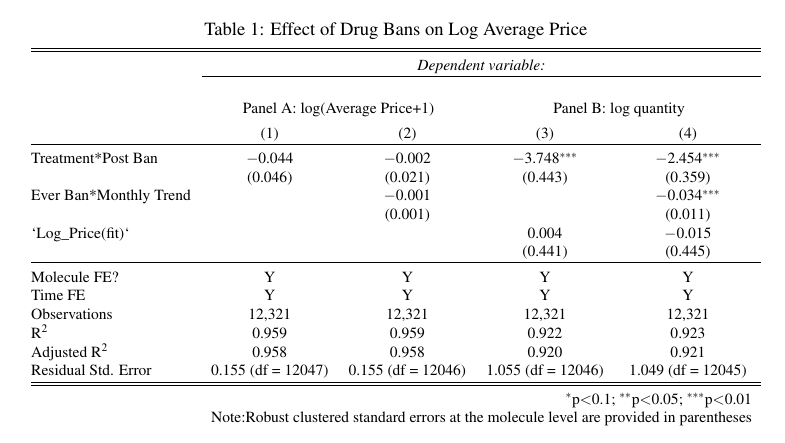

```

---
#.center.pull[Event Study Estimates]

- Estimating standard DID with no controls over the two periods:

  $$y_{mt} = \alpha_m + \alpha_t + \sum_{k = k_*}^{k^*} \delta_{k} D_{mt} + \epsilon_{mt}$$
where $\alpha_m$ and $\alpha_t$ are molecule and year fixed effects respectively, and $\delta_k$ are the coefficients on the lead/lag indicators for years around treatment. 

- For now, I will restrict the estimates to 18 and 20 months pre and post treatment respectively.

- $y_{mt}$ corresponds to all the outcome variables that we have considered so far. 

- The error bars represent confidence intervals at 95% level constructed from the robust s.e.'s clustered at the molecule level.

- In case of log sales estimates, I control for log prices by instrumenting it through Price to retailers, as specified earlier.


---
# .center.pull[Results]

```{r image_grobs, echo=FALSE ,fig.show = "hold", out.width = "50%", fig.align = "default"}

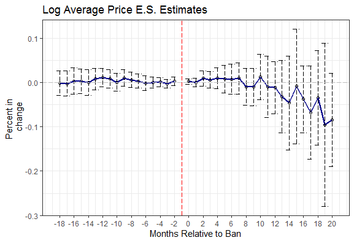

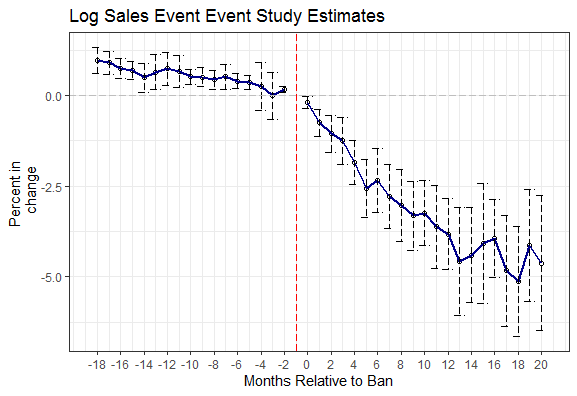

```

---
# .center.pull[Results]

```{r , echo = FALSE, warning = FALSE, message = FALSE, fig.align = 'center', fig.width = 12, fig.height = 5, cache = TRUE}
# load the plot already made
knitr::opts_chunk$set(fig.pos = 'H')
knitr::include_graphics("Table_2.png")

```

---
# .center.pull[Results]

- Following from the previous event study specification, we breakdown estimates for Price Volatility and Price Dispersion.

```{r image_grobs_1, echo=FALSE ,fig.show = "hold", out.width = "50%", fig.align = "default"}

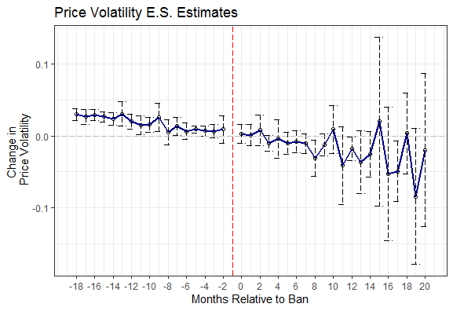

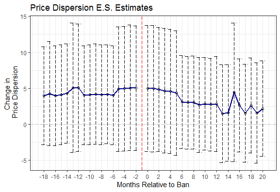

```

---
#.center.pull[Market Concentration Results]
- We also test for change in market power in response to the ban, within a molecule with the following specification:
$$HHI_{mt} = \alpha_m + \alpha_t + \delta^{DD} D_{mt} + \epsilon_{mt}$$
- We also replace HHI with number of firms to test for the impact of ban on the presence of firms within a molecule.

- Again we run an event study regression to understand the differential impact of the regulation on the market structure of pharma-industry in India with the following specification:

  $$HHI_{mt} = \alpha_m + \alpha_t + \sum_{k = k_*}^{k^*} \delta_k D_{mt} + \epsilon_{mt}$$
where all the terms follow from the previous specifications. Leads, Lags are restricted to 18 and 20 respectively for the current design.


---
# .center.pull[Results]
```{r , echo = FALSE, warning = FALSE, message = FALSE, fig.align = 'center', fig.width = 9, fig.height = 4, cache = TRUE}
# load the plot already made
knitr::opts_chunk$set(fig.pos = 'H')
knitr::include_graphics("Table_5.png")

```


---
# .center.pull[Results]


```{r image_grobs_2, echo=FALSE ,fig.show = "hold", out.width = "50%", fig.align = "default"}

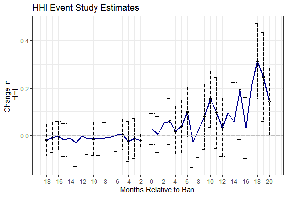

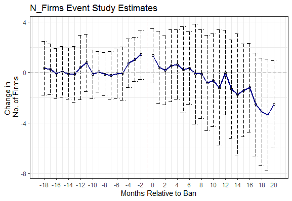

```


---
# .center.pull[Model Specification-(II)]

- Here, we specify our model at the firm-molcule-time level to allow for the firm-level hetrogeneity.
$$y_{fmt} = \alpha_{f}  + \alpha_{m} + \alpha_{t} + \alpha_{m}*calendarmonth_{t} + \alpha_{m}*\alpha_{f} + X_{fmt}   + \delta^{DD} D_{fmt} +  \epsilon_{fmt}$$  
  - Here, $\alpha_{f}$ corresponds to firm-level fixed effects.
  - We are also allowing for molecule fe's to vary at an yearly level, and molecule-specific firm fe's.
  - We are interested in the DID-coefficient $\delta^{DD}$.

- Similarly, we also test for differential impact of these bans on the domestic vis-a-vis MNC firms, by utilizing triple diff-in-diff setting, as specified below:
$$
\begin{aligned}
y_{fmt} = \alpha_{f}  + \alpha_{m} + \alpha_{t} + \alpha_{m}*calendarmonth_{t} + \alpha_{m}*\alpha_{f} + X_{fmt} +\\ \delta^{DD} D_{fmt}   + \gamma^{DDD} D_{fmt}*MNC_{f} + \epsilon_{fmt}
\end{aligned}
$$
  - Here, $MNC_{f}$ is a dummy indicating the firm being an MNC.
  - Notice that, all other interactions have already been subsumed in the fixed effects and their      respective interaction terms.

<!-- - Doubt: For a given company and a molecule, while calculating price dispersion,should we look at the range of prices of a brand within that molecule or across all brands? -->

<!-- - Doubt: For a given molecule, while calculating price dispersion I am simply taking a difference b/w max and min price. But I highly doubt that this is the right way to go about it coz then I am simply comparing uncomparables within a molecule. -->


---
# .center.pull[Results]

```{r , echo = FALSE, warning = FALSE, message = FALSE, fig.align = 'center', fig.width = 14, fig.height = 8, cache = TRUE}
# load the plot already made
knitr::opts_chunk$set(fig.pos = 'H')
knitr::include_graphics("Table_3.png")

```
---

#.center.pull[Event Study Estimates]

- Estimating standard double DID and Triple DID estimates  over the two periods:


  
$$
\begin{aligned}
 y_{fmt} = \alpha_{f}  + \alpha_{m} + \alpha_{t} + \alpha_{m}*calendarmonth_{t}+ \alpha_{m}*\alpha_{f} + X_{fmt} \\ + \sum_{k = k_*}^{k^*} \delta_k D_{fmt} + \sum_{k = k_*}^{k^*}\gamma^{DDD}_K D_{fmt}*MNC_{f} + \epsilon_{fmt}
\end{aligned}
$$
  - where all fe terms follow from previous specifications, and $\delta_k$, $\gamma_k^{DDD}$ are the double and triple interaction coefficients on the lead/lag indicators for months around treatment. 

- Here also, I will restrict the estimates to 18 and 20 months pre and post treatment respectively.

- $y_{mt}$ corresponds to all the outcome variables that we have considered so far. 

- The error bars represent confidence intervals at 95% level constructed from the robust s.e.'s clustered at the molecule-firm level.

---

# .center.pull[Results]

```{r image_grobs_4, echo=FALSE ,fig.show = "hold", out.width = "50%", fig.align = "default"}

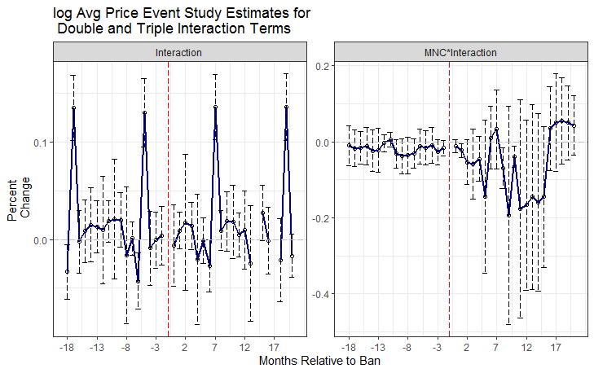

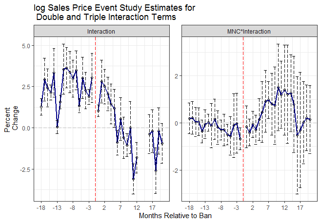

```

---

# .center.pull[Results]

```{r , echo = FALSE, warning = FALSE, message = FALSE, fig.align = 'center', fig.width = 14, fig.height = 8, cache = TRUE}
# load the plot already made
knitr::opts_chunk$set(fig.pos = 'H')
knitr::include_graphics("Table_4.png")

```

---

# .center.pull[Results]

```{r image_grobs_5, echo=FALSE ,fig.show = "hold", out.width = "50%", fig.align = "default"}

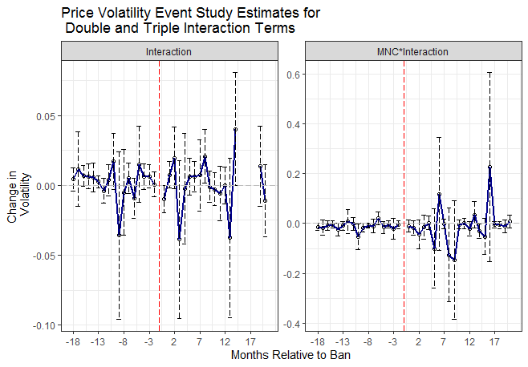

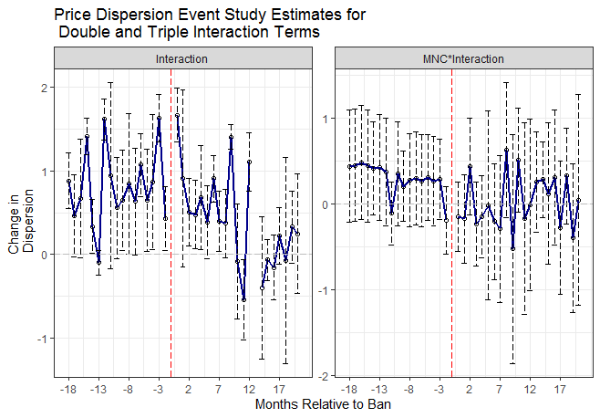

```

---
# .center.pull[Model Specification-(III)]
- Here, we specify our model at the molecule-geography-time level to allow for the region-level hetrogeneity.

- In particular, I will be estimating the following specification.
$$
\begin{aligned}
y_{mgt} = \alpha_{g}  + \alpha_{m} + \alpha_{t} + \lambda*\alpha_{t}*I(Ever Ban) +  
\alpha_{m}*\alpha_{g} +  \alpha_{g}*\alpha_{t} \\ + X_{mgt}  + \delta^{DD} D_{fmt} + \epsilon_{mgt}
\end{aligned}
$$
- Here, $y_{mgt}$ corresponds to either log sales or variety of SKU's at the geography molecule time level.
- In addition to that, we also control for region specific fixed effects represented by $\alpha_{g}$, molecule fe's varying by different regions captured by $\alpha_{m}*\alpha_{g}$, and time fe's varying by regions represented by $\alpha_{g}*\alpha_{t}$. We also control for time trend of those molecules that were subjected to the ban, represented by $\lambda*\alpha_{t}*I(Ever Ban)$.
- $X_{mgt}$ term represents other necessary controls such as HHI, and log Price instrumented by Price to Retailers in case, $y_{mgt}$ corresponds to log output.
- We are primarily interested in the $\delta^{DD}$ coefficient which estimates the differential impact on the treated molecules.
- Several variants of the above specification are also estimated, where we exclude either $\alpha_{m}*\alpha_{g}$ or $\alpha_{g}*\alpha_{t}$, while keeping everything else intact.

---
# .center.pull[Results]

```{r , echo = FALSE, warning = FALSE, message = FALSE, fig.align = 'center', fig.width = 14, fig.height = 7, cache = TRUE}
# load the plot already made
knitr::opts_chunk$set(fig.pos = 'H')
knitr::include_graphics("Table_6.png")

```

---
# .center.pull[Event Study Estimates]

- Again, I will run the following specification to extract the event study estimates:

$$
\begin{aligned}
y_{mgt} = \alpha_{g}  + \alpha_{m} + \alpha_{t} + \lambda*\alpha_{t}*I(Ever Ban) \\ 
\sum_{k = k_*}^{k^*} \delta_k D_{mt} + X_{mgt}  + \epsilon_{mgt}
\end{aligned}
$$

where all the terms follow from the previous specification, and $\delta_k$ are the coefficients on the lead/lag indicators for years around treatment. 

- Here also, I will restrict the estimates to 18 and 20 months pre and post treatment respectively.

- $y_{mt}$ corresponds to either Log Sales or Variety at the region molecule time level. 

- The error bars represent confidence intervals at 95% level constructed from the robust s.e.'s clustered at the molecule-geography level.

- In case of log sales estimates, I control for log prices by instrumenting it through Price to retailers, as specified earlier.

- Variety estimates are derived from a Poisson regressions using MLE.

---

# .center.pull[Results]

```{r image_grobs_6, echo=FALSE ,fig.show = "hold", out.width = "50%", fig.align = "default"}

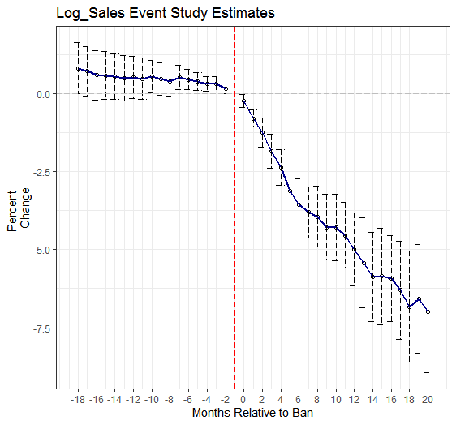

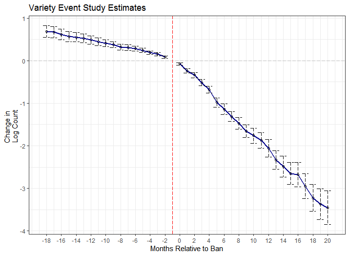

```

---

# .center.pull[Summary]

- There is substantial evidence of contraction in the market of abandoned products following the bans.

- No effect on the change in pricing strategy, price volatility, or price dispersion at different levels.

- This shows that regulation had a huge impact on the market structure of Indian pharma-industry.

- However, results are open to scrutiny due to the imperfection of the utilized estimator in delivering consistent estimates.

# .center.pull[Future Work]

- Repeat the same analysis with a smaller set of narrow controls.

- Extending the analysis to capture the products that were banned b/w the period of 2014-2019.

- Corroborate our findings by utilizing the IQVIA database to tease out the contraction in market induced by the demand-side of the market.

- Also apply Goodman-Bacon decomposition to see the breakdown of the 2x2 diff-in-diff estimates and the weights associated with them. This would help us in identifying the main force behind the final estimate. (i.e. Is it control vs treated or early treated vs late treated, etc.)


  